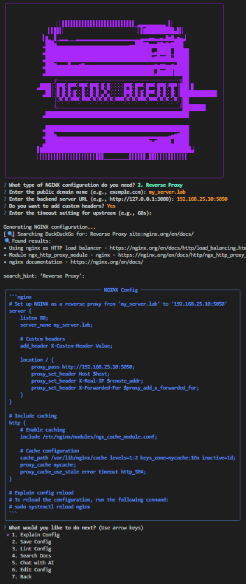

# nginx_agent

**nginx_agent** is an AI-powered CLI assistant that helps you generate, explain, lint, and manage NGINX configuration files. It uses a local [Mistral](https://mistral.ai) model (via [Ollama](https://ollama.com)) and DuckDuckGo search to bring you documentation-aware, customizable configurations — fast.

>  This project uses the Mistral model specifically for generating and modifying NGINX configurations through natural language prompts.

  <!-- optional preview -->

---

##  Features

- 🔧 Generate NGINX config files for:
  - Reverse proxy
  - Forward proxy
  - Load balancing
  - SSL termination
  - Static file hosting
  - Security headers and rate limiting
  - Docker Compose-based microservices

- 💬 Interact with Mistral (via Ollama) to explain or modify the config
- 🔍 Search official [nginx.org](https://nginx.org/en/docs/) docs with DuckDuckGo
- 💾 Save and lint files using `nginx -t`
- 📄 Colorful, professional TUI with [Questionary](https://github.com/tmbo/questionary) and [Rich](https://github.com/Textualize/rich)

---

##  Installation

### 1. Install dependencies

```bash
# Python
pip install -r requirements.txt

# NGINX (for linting)
sudo apt install nginx  # or brew install nginx on macOS

# Ollama (for running Mistral)
https://ollama.com/download
```

### 2. Pull the Mistral model for Ollama
```bash
ollama pull mistral
```

### 3. Setup your environment
Create a `.env` file in the root:

```env
OLLAMA_MODEL=mistral
```

---

##  Example usage

### Reverse Proxy

```bash
python main.py
```
Then choose:
```
1. Reverse Proxy
Domain name: my_server.lab
Backend server: http://127.0.0.1:3000
```

The tool will generate a config like:

```nginx
server {
    listen 80;
    server_name my_server.lab;

    location / {
        proxy_pass http://127.0.0.1:3000;
        proxy_set_header Host $host;
        proxy_set_header X-Real-IP $remote_addr;
    }
}
```

You can then:
- Explain the config
- Edit it
- Lint it
- Save it
- Ask Mistral to modify it (e.g. "add CORS headers")

---

##  Docker Compose Support

Choose "8. From Docker Compose" to scan a `docker-compose.yml` like:

```yaml
services:
  web:
    image: nginx
    ports:
      - "8080:80"

  api:
    image: node:18
    ports:
      - "3000:3000"
```

And you will receive a reverse proxy config

---

##  Dependencies

```text
rich
questionary
dotenv
ollama
duckduckgo-search
pyyaml
```

---
